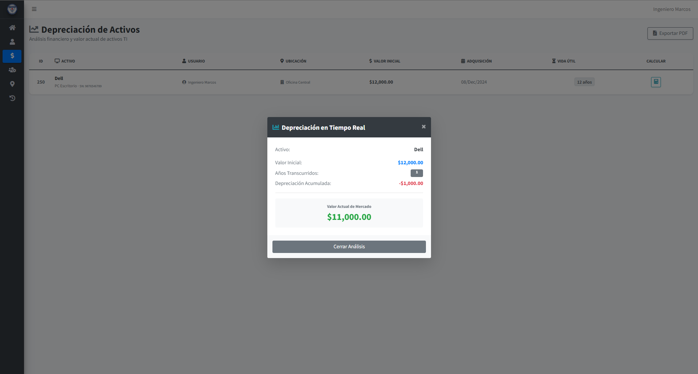
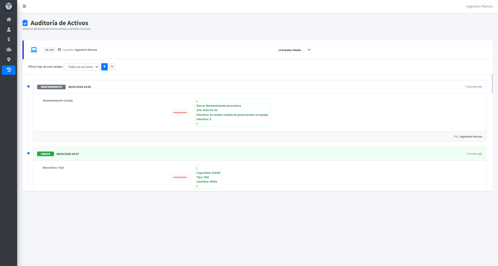

<h1>
   
  Gestión de Activos de PIHCSA
</h1>
## PIHCSA Asset Management

Sistema de Gestión de Activos de TI desarrollado para **PIHCSA**, enfocado en optimizar el control, registro, seguimiento y auditoría de activos tecnológicos dentro del **sector médico**.

IT Asset Management System developed for **PIHCSA**, focused on optimizing control, registration, tracking, and auditing of technological assets within the **healthcare sector**.

---

## Insignias / Badges

**Tecnología / Technology**  
Laravel v10 · PHP v8.2 · MySQL  

**Estado / Status**  
Build: Passing

---

## Visuales

1. Dashboard principal  

2. Wizard de registro (primer paso)  
   Asset registration wizard (first step)  

3. Calculo de asset depreciation
   Asset activity and history log  
  

4. Historial de movimientos del activo  
   Asset activity and history log  
  

---

## Instalación / Installation

Requisitos Previos / Prerequisites
- PHP >= 8.2

- Composer

- MariaDB >= 10.4

- Servidor Apache con módulo mod_rewrite habilitado.

Pasos de Configuración / Configuration Steps

- 1.-Clonar el repositorio / Clone the repository:
  ``git clone https://github.com/tu-usuario/gestion_activos.git
  cd gestion_activos``

- 2.-Instalar dependencias / Install dependencies:
  ``composer install``

- 3.-Configurar variables de entorno / Environment configuration:
``
  DB_CONNECTION=mysql
  DB_HOST=127.0.0.1
  DB_PORT=3306
  DB_DATABASE=gestion_activos
  DB_USERNAME=tu_usuario
  DB_PASSWORD=tu_contraseña
  ``

- 4.-Generar llave de aplicación / Generate app key:
  ``php artisan key:generate``

- 5.-Restaurar Base de Datos / Database Restoration:
  ``mysql -u tu_usuario -p gestion_activos < database/backups/base.sql``

- 6.-Optimización de servidor (Producción) / Server Optimization
  ### Apache Conf
  ``
  <Directory /var/www/html/public>
      AllowOverride All
  </Directory>
  ``

- 7.-Limpieza de caché / Clear Cache:
  ``
  php artisan config:cache
  php artisan route:cache
  ``

### Notas de Implementación / Implementation Notes
- La interfaz está construida sobre AdminLTE 3, integrada mediante el paquete oficial para Laravel.
- Se requiere permisos de escritura en las carpetas storage y bootstrap/cache.

---

## Uso / Usage

Al ingresar al sistema, un usuario administrador puede gestionar el **ciclo completo de vida de un activo de TI**, desde su registro inicial hasta su historial de cambios y auditoría.

Upon accessing the system, an administrator can manage the **complete lifecycle of an IT asset**, from initial registration to its full change and audit history.

El sistema garantiza:

- Auditoría completa de cada activo  
- Trazabilidad de asignaciones y componentes  
- Registro histórico de movimientos  
- Control centralizado y consistente de la información  

The system ensures:

- Complete auditability of each asset  
- Traceability of assignments and components  
- Historical record of movements  
- Centralized and consistent data control  

---

## Soporte / Support

Para dudas técnicas relacionadas con la arquitectura, lógica del sistema o implementación:

For technical questions related to architecture, system logic, or implementation:

- Correo / Email: **johanlopezrey1@gmail.com**  
- O bien, abrir un Issue en este repositorio  
- Or open an Issue in this repository  

---

## Contribución / Contribution

Este es un **proyecto privado**, desarrollado específicamente para PIHCSA.

This is a **private project**, developed specifically for PIHCSA.

- No se aceptan Pull Requests externos  
- El código puede ser clonado con fines educativos  

- External Pull Requests are not accepted  
- The code may be cloned for educational purposes  

---

## Autores y Agradecimientos / Authors and Acknowledgements

**Autor / Author**  
Johan Jael López Reyes  
LinkedIn: https://www.linkedin.com/in/johan-lopez-1132802b5/

**Agradecimientos / Acknowledgements**  
A la empresa **PIHCSA** y al **Ing. Marcos Robles** por la oportunidad de colaborar en la solución de un problema real dentro de un entorno profesional.

Special thanks to **PIHCSA** and **Ing. Marcos Robles** for the opportunity to work on solving a real-world problem in a professional environment.

---

Este proyecto forma parte de un proceso de crecimiento técnico y profesional, con enfoque en buenas prácticas, mantenibilidad y experiencia de usuario.

This project is part of a technical and professional growth process, focused on best practices, maintainability, and user experience.

---

<table align="center" border="0">
  <tr>
    <td align="center" valign="center">
      
    </td>
    <td align="center" valign="center">
      
    </td>
    <td align="center" valign="center">
      
    </td>
    <td align="center" valign="center">
      
    </td>
  </tr>
</table>
