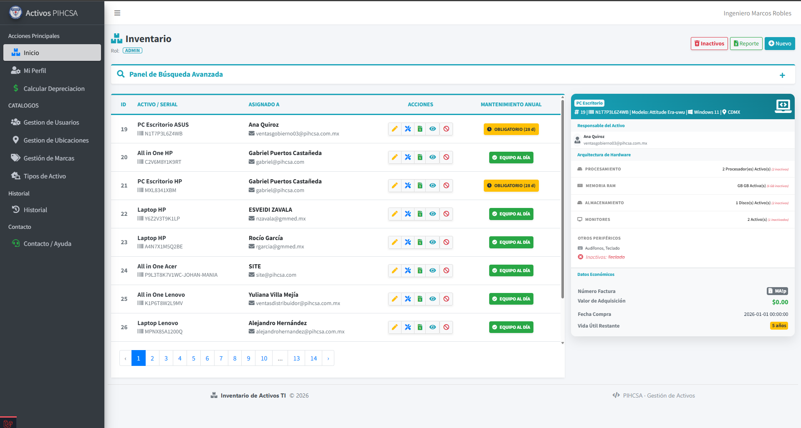
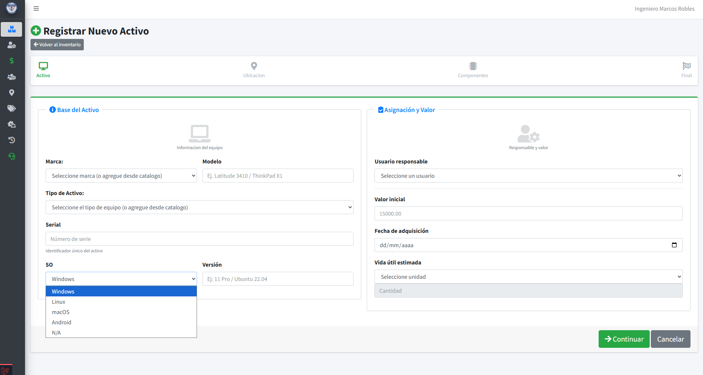
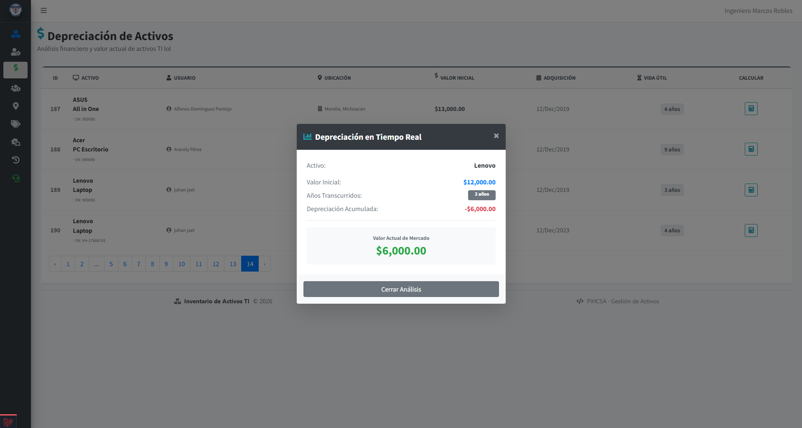
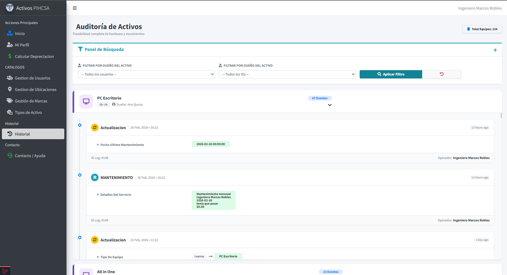

from pathlib import Path

content = """README CONTENT — ENGLISH & SPANISH VERSION
============================================

VERSIÓN EN ESPAÑOL
==================

# Gestión de Activos PIHCSA

Sistema ERP interno para la gestión, control, auditoría y trazabilidad de activos empresariales.

Tecnologías principales:
- Laravel 10
- PHP 8.2+
- MySQL / MariaDB
- AdminLTE
- Blade Templates
- Eloquent ORM
- Bootstrap
- JavaScript
- Git / GitHub

---

## Descripción del Proyecto

Gestión de Activos PIHCSA es un sistema ERP web desarrollado para administrar activos tecnológicos, vehículos, usuarios, catálogos, sucursales, reportes y auditoría histórica dentro de un entorno empresarial.

El sistema permite controlar el ciclo de vida de los activos, desde su registro inicial hasta sus mantenimientos, modificaciones, reasignaciones, inactivaciones y reportes operativos.

Una de sus características principales es el manejo de múltiples bases de datos por empresa o entorno operativo, permitiendo separar la información de forma segura y clara según el contexto seleccionado por el usuario.

---

## Módulos Principales

### Gestión de Equipos

- Registro de activos tecnológicos.
- Control de marca, modelo, serial, factura y sistema operativo.
- Asignación de usuario responsable.
- Ubicación actual del activo.
- Estado activo / inactivo.
- Control de mantenimiento.

### Componentes de Hardware

- Procesadores.
- Memoria RAM.
- Discos duros.
- Monitores.
- Periféricos.
- Separación entre componentes actuales e históricos.

### Gestión de Vehículos

- Registro de vehículos.
- Marca tipo AUTO.
- Modelo, año, placas, VIN y número de motor.
- Cilindros, combustible y pedimento.
- Control financiero y ciclo de vida.
- Documentación y seguro.
- Relación con sucursal operativa.

### Catálogos

- Usuarios.
- Marcas.
- Tipos de activos.
- Ubicaciones.
- Empresas / entornos.
- Tipos de vehículos.
- Sucursales / bases de datos.

### Multi-base de Datos

- Selección obligatoria de empresa o entorno al iniciar sesión.
- Cambio dinámico de conexión mediante middleware.
- Indicador global de base activa.
- Creación de nuevas bases con estructura clonada.
- Bases nuevas limpias con usuario administrador inicial.

### Reportes

El sistema maneja dos tipos de reportes:

#### Reporte Actual

- Muestra únicamente el estado vigente de cada activo.
- Una fila representa un activo actual.
- No incluye movimientos históricos.
- No muestra componentes inactivos o partidas anteriores.

#### Reporte Histórico

- Muestra los movimientos realizados sobre los activos.
- Una fila representa un evento o modificación.
- Incluye mantenimientos, actualizaciones, eliminaciones y cambios registrados.
- Limpieza de HTML y formato legible para Excel.

### Auditoría e Historial

- Registro de movimientos por activo.
- Usuario que realizó la acción.
- Fecha y hora del evento.
- Detalle del cambio realizado.
- Trazabilidad completa de modificaciones.

---

## Retos Técnicos Resueltos

### Registro de hardware complejo

El sistema permite registrar equipos con múltiples componentes relacionados, como RAM, discos, procesadores, monitores y periféricos.

Solución:
Implementación de un flujo de registro estructurado y relaciones Eloquent para controlar cada componente del activo.

### Trazabilidad de movimientos

Era necesario conocer qué cambios se realizaban sobre cada activo y quién los ejecutaba.

Solución:
Módulo de historial que registra eventos, usuario responsable, fecha y detalles en formato JSON.

### Separación entre estado actual e histórico

El reporte general mostraba movimientos anteriores junto con el estado actual del activo.

Solución:
Separación de reportes:
- Reporte actual: estado vigente del activo.
- Reporte histórico: movimientos y eventos registrados.

### Multi-base de datos

La operación requería separar información por empresa o entorno operativo.

Solución:
Middleware de conexión dinámica que cambia la base activa según la selección del usuario después del login.

### Control visual de contexto

Los usuarios podían confundirse sobre la base de datos o entorno donde estaban trabajando.

Solución:
Selector obligatorio de empresa al iniciar sesión e indicador global de base activa visible en todo el sistema.

---

## Arquitectura

El sistema sigue el patrón MVC de Laravel:

- Models: Representan entidades como equipos, usuarios, vehículos, marcas y sucursales.
- Views: Construidas con Blade y AdminLTE.
- Controllers: Gestionan la lógica de los módulos.
- Services: Encapsulan lógica especializada como generación de reportes.
- Middleware: Controla autenticación, selección de base y contexto operativo.

---

## Seguridad y Control

- Login protegido.
- Roles de usuario.
- Middleware de autenticación.
- Middleware para selección obligatoria de base.
- Validaciones backend.
- Protección contra eliminación de registros relacionados.
- Limpieza de datos en reportes.
- Separación de información por base de datos.

---

## Visuales

### Inventario de Equipos

### Registro de Activos

### Depreciación

### Historial de Movimientos

---

## Instalación

### Requisitos

- PHP >= 8.2
- Composer
- MySQL o MariaDB
- Apache o Nginx
- Node.js y NPM, si se compilan assets
- Extensiones PHP requeridas por Laravel

### Clonar repositorio

git clone https://github.com/tu-usuario/gestion_activos.git
cd gestion_activos

### Instalar dependencias

composer install

### Configurar archivo .env

cp .env.example .env

Configurar la conexión a base de datos:

DB_CONNECTION=mysql
DB_HOST=127.0.0.1
DB_PORT=3306
DB_DATABASE=gestion_activos_pihcsa_v2
DB_USERNAME=tu_usuario
DB_PASSWORD=tu_contraseña

### Generar llave de aplicación

php artisan key:generate

### Restaurar base de datos

mysql -u tu_usuario -p gestion_activos_pihcsa_v2 < database/backups/base.sql

### Limpiar y optimizar caché

php artisan optimize:clear
php artisan config:cache
php artisan route:cache
php artisan view:cache

### Servidor local

php artisan serve

---

## Notas de Implementación

- La interfaz está construida con AdminLTE 3.
- El sistema utiliza conexiones dinámicas para trabajar con distintas bases de datos.
- Las nuevas bases pueden generarse desde el panel administrativo.
- El sistema distingue entre inventario actual e historial de movimientos.
- Se recomienda no modificar directamente archivos dentro de vendor.
- Las carpetas storage y bootstrap/cache requieren permisos de escritura.

---

## Uso General

Al iniciar sesión, el usuario selecciona la empresa o entorno donde trabajará.
Después puede acceder a los módulos de inventario, vehículos, catálogos, reportes y auditoría.

El sistema permite:

- Registrar activos tecnológicos.
- Administrar componentes.
- Registrar vehículos.
- Gestionar usuarios y catálogos.
- Consultar el estado actual de los activos.
- Revisar movimientos históricos.
- Exportar reportes en CSV.
- Trabajar en diferentes bases de datos según el contexto seleccionado.

---

## Estado del Proyecto

Estado: En desarrollo funcional
Versión: 1.0
Build: Passing

---

## Próximas Mejoras

- Exportación directa a Excel .xlsx.
- Dashboard con indicadores generales.
- Firma digital de resguardos.
- Notificaciones automáticas.
- API REST para integraciones externas.
- Pruebas automatizadas.
- Mejoras visuales en reportes.

---

## Autor

Johan Jael López Reyes
LinkedIn: https://www.linkedin.com/in/johan-lopez-1132802b5/

---

## Agradecimientos

A PIHCSA y al Ing. Marcos Robles por la oportunidad de colaborar en el desarrollo de una solución real dentro de un entorno profesional.

---

## Nota

Este proyecto fue desarrollado como una solución empresarial privada para PIHCSA.
El código puede ser utilizado como referencia educativa o técnica, según los permisos definidos por el propietario del proyecto.

ENGLISH VERSION
===============

# PIHCSA Asset Management

Internal ERP system for the management, control, auditing, and traceability of business assets.

Main technologies:
- Laravel 10
- PHP 8.2+
- MySQL / MariaDB
- AdminLTE
- Blade Templates
- Eloquent ORM
- Bootstrap
- JavaScript
- Git / GitHub

---

## Project Description

PIHCSA Asset Management is a web-based ERP system developed to manage IT assets, vehicles, users, catalogs, branches, reports, and historical audit logs within a business environment.

The system allows the company to control the full lifecycle of assets, from their initial registration to maintenance, updates, reassignment, deactivation, and operational reporting.

One of its key features is the use of multiple databases by company or operational environment, allowing secure and clear data separation according to the context selected by the user.

---

## Main Modules

### Equipment Management

- Registration of IT assets.
- Control of brand, model, serial number, invoice, and operating system.
- Assignment to a responsible user.
- Current asset location.
- Active / inactive status.
- Maintenance control.

### Hardware Components

- Processors.
- RAM memory.
- Hard drives.
- Monitors.
- Peripherals.
- Separation between current and historical components.

### Vehicle Management

- Vehicle registration.
- AUTO brand classification.
- Model, year, plates, VIN, and engine number.
- Cylinders, fuel type, and import/customs document.
- Financial control and lifecycle.
- Documentation and insurance.
- Relationship with operational branch.

### Catalogs

- Users.
- Brands.
- Asset types.
- Locations.
- Companies / environments.
- Vehicle types.
- Branches / databases.

### Multi-database Architecture

- Mandatory company or environment selection after login.
- Dynamic database connection switching through middleware.
- Global active database indicator.
- Creation of new databases with cloned structure.
- Clean new databases with an initial administrator user.

### Reports

The system handles two types of reports:

#### Current Report

- Shows only the current state of each asset.
- One row represents one current asset.
- Does not include historical movements.
- Does not show inactive components or previous records.

#### Historical Report

- Shows movements performed on assets.
- One row represents one event or modification.
- Includes maintenance, updates, deletions, and registered changes.
- Cleans HTML and provides readable formatting for Excel.

### Audit and History

- Movement log by asset.
- User who performed the action.
- Event date and time.
- Detail of the performed change.
- Full traceability of modifications.

---

## Key Technical Challenges Solved

### Complex hardware registration

The system allows the registration of equipment with multiple related components such as RAM, hard drives, processors, monitors, and peripherals.

Solution:
Implementation of a structured registration flow and Eloquent relationships to control each asset component.

### Movement traceability

It was necessary to know what changes were made to each asset and who performed them.

Solution:
A history module that records events, responsible user, date, and details in JSON format.

### Separation between current state and history

The general report previously mixed past movements with the current state of the asset.

Solution:
Report separation:
- Current report: current asset state.
- Historical report: registered movements and events.

### Multi-database architecture

The operation required separating information by company or operational environment.

Solution:
Dynamic connection middleware that changes the active database according to the user's selection after login.

### Visual context control

Users could get confused about which database or environment they were working in.

Solution:
Mandatory company selection after login and a global active database indicator visible throughout the system.

---

## Architecture

The system follows Laravel's MVC pattern:

- Models: Represent entities such as equipment, users, vehicles, brands, and branches.
- Views: Built with Blade and AdminLTE.
- Controllers: Manage module logic.
- Services: Encapsulate specialized logic such as report generation.
- Middleware: Controls authentication, database selection, and operational context.

---

## Security and Control

- Protected login.
- User roles.
- Authentication middleware.
- Middleware for mandatory database selection.
- Backend validations.
- Protection against deletion of related records.
- Data cleaning in reports.
- Data separation by database.

---

## Screenshots

### Equipment Inventory

### Asset Registration

### Depreciation

### Movement History

---

## Installation

### Requirements

- PHP >= 8.2
- Composer
- MySQL or MariaDB
- Apache or Nginx
- Node.js and NPM, if assets are compiled
- PHP extensions required by Laravel

### Clone repository

git clone https://github.com/tu-usuario/gestion_activos.git
cd gestion_activos

### Install dependencies

composer install

### Configure .env file

cp .env.example .env

Configure database connection:

DB_CONNECTION=mysql
DB_HOST=127.0.0.1
DB_PORT=3306
DB_DATABASE=gestion_activos_pihcsa_v2
DB_USERNAME=your_user
DB_PASSWORD=your_password

### Generate application key

php artisan key:generate

### Restore database

mysql -u your_user -p gestion_activos_pihcsa_v2 < database/backups/base.sql

### Clear and optimize cache

php artisan optimize:clear
php artisan config:cache
php artisan route:cache
php artisan view:cache

### Local server

php artisan serve

---

## Implementation Notes

- The interface is built with AdminLTE 3.
- The system uses dynamic connections to work with different databases.
- New databases can be generated from the admin panel.
- The system distinguishes between current inventory and movement history.
- Direct modification of files inside vendor is not recommended.
- The storage and bootstrap/cache directories require write permissions.

---

## General Usage

After logging in, the user selects the company or environment where they will work.
Then they can access inventory, vehicles, catalogs, reports, and audit modules.

The system allows users to:

- Register IT assets.
- Manage components.
- Register vehicles.
- Manage users and catalogs.
- Check the current state of assets.
- Review historical movements.
- Export CSV reports.
- Work across different databases depending on the selected context.

---

## Project Status

Status: Functional development
Version: 1.0
Build: Passing

---

## Future Improvements

- Direct export to Excel .xlsx.
- Dashboard with general indicators.
- Digital asset custody signatures.
- Automatic notifications.
- REST API for external integrations.
- Automated testing.
- Visual improvements in reports.

---

## Author

Johan Jael López Reyes
LinkedIn: https://www.linkedin.com/in/johan-lopez-1132802b5/

---

## Acknowledgements

Special thanks to PIHCSA and Ing. Marcos Robles for the opportunity to collaborate in the development of a real solution within a professional environment.

---

## Note

This project was developed as a private business solution for PIHCSA.
The code may be used as an educational or technical reference, according to the permissions defined by the project owner.
"""

path = Path("/mnt/data/PIHCSA_Asset_Management_README_ES_EN.txt")
path.write_text(content, encoding="utf-8")
print(path)
